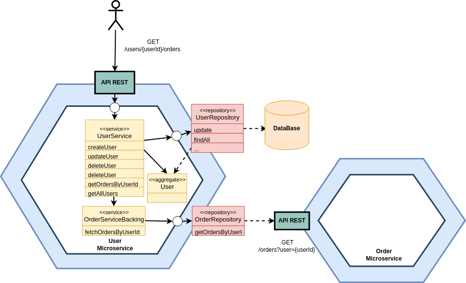

#  <%= name %>

This example emphasize the alignment of the microservice with architectural guidelines while still indicating its purpose of managing user data through CRUD operations in a Node.js environment. The specific terminology you choose can be based on your project's naming conventions and the importance of architectural compliance.

## Table of Contents

- [<%= name %>](#<%= name %>)
  - [Table of Contents](#table-of-contents)
  - [Overview](#overview)
  - [Installation](#installation)
    <%_ if (buildingContainerImages && buildingContainerImages === 'buildah') { _%>
    - [Buildah \& Podman](#buildah--podman)
    <%_ } _%>
    <%_ if (buildingContainerImages && buildingContainerImages === 'docker') { _%>
    - [Docker](#docker)
    <%_ } _%>
    - [Apidoc \& Snyk (Required)](#apidoc--snyk-required)
  - [Usage](#usage)
  - [Features](#features)
  - [Run locally](#run-locally)
  - [Running the health check](#running-the-health-check)

## Overview

The following describes how business logic is mapped in a microservice architecture.



## Installation

<%_ if (buildingContainerImages && buildingContainerImages === 'buildah') { _%>
### Buildah & Podman

Here are the steps to install buildah and podman on a Debian-based system like Ubuntu using third-party repositories:

- Add the Repository:

You need to add the third-party repository that provides buildah and podman. In this example, we'll use the one maintained by Project Atomic. Open a terminal and run the following commands:

```bash
sudo apt update
sudo apt install software-properties-common
sudo add-apt-repository ppa:projectatomic/ppa
```

- Update Package List:

After adding the repository, update the package list again:

```bash
sudo apt update
```
- Install buildah and podman:

You can now install buildah and podman:

```bash
sudo apt install buildah podman
```

This command will install both buildah and podman on your system.
<%_ } _%>

<%_ if (buildingContainerImages && buildingContainerImages === 'docker') { _%>
### Docker


To install Docker on Ubuntu, you can follow these steps.

- Update Package List:

First, open a terminal and make sure your package list is up to date:

```bash
sudo apt update
```

- Install Required Dependencies:
  
Docker requires some dependencies to be installed. You can install them with the following command:

```bash
sudo apt install -y apt-transport-https ca-certificates curl software-properties-common
```

- Add Docker Repository:

Add Docker's official GPG key to your system and add the Docker repository:

```bash
curl -fsSL https://download.docker.com/linux/ubuntu/gpg | sudo gpg --dearmor -o /usr/share/keyrings/docker-archive-keyring.gpg

echo "deb [signed-by=/usr/share/keyrings/docker-archive-keyring.gpg] https://download.docker.com/linux/ubuntu $(lsb_release -cs) stable" | sudo tee /etc/apt/sources.list.d/docker.list > /dev/null
```

This command adds the Docker repository to your package manager sources.

- Update Package List (Again):
  
Update the package list once more to include the Docker repository:

```bash
sudo apt update
```

- Install Docker:
  
Now you can install Docker using the following command:

```bash
sudo apt install docker-ce
```

If you want to install a specific version of Docker, you can specify it in the command. For example, to install Docker version 20.10:

```bash
sudo apt install docker-ce=5:20.10.11~3-0~ubuntu-focal
```

- Start and Enable Docker:

Once Docker is installed, you can start the Docker service and enable it to start on boot:

```bash
sudo systemctl start docker
sudo systemctl enable docker
```

- Verify Installation:

To verify that Docker is installed and running correctly, you can run the following command:

```bash
sudo docker --version
```

This should display the Docker version that you installed.
<%_ } _%>

### Apidoc & Snyk (Required)


To operate effectively you need install globally modules on your system.

- Install apidoc globally:

To generate API documentation using apidoc, you can install it with the following command:

```bash
npm install -g apidoc
```

- Install snyk globally:

Snyk is a tool for finding and fixing vulnerabilities in your project's dependencies. You can install it with the following command:

```bash
npm install -g snyk
```

## Usage

After you generate your project, you can use these commands to manage the lifecycle of a Node.js project. These commands are typically 
related to package management and scripts defined in your project's `package.json` file. 

```bash
npm test # test using Jest
npm run coverage #  runs the tests and generates code coverage reports
npm run lint # lint using ESLint
npm run dev # run the API in development mode
npm run docs # generate API docs
npm run cont-build # builds an image with the name specified in the npm package name.
npm run cont-run # starts a container in detached mode.
npm run cont-stop # stops a container.
npm run cont-rm-image # removes an image associated with the npm package name.
npm run cont-logs # displays the logs of the running container.
npm run find-sec-vulns # authenticates with Snyk and runs a security vulnerability test on the container.
<%_ if (buildingContainerImages && buildingContainerImages === 'buildah') { _%>
npm run cont-clean-all-images # remove unused data (containers, images, and other resources) to free up disk space.
npm run cont-tag # create a new tag (alias) for an existing Docker image.
npm run cont-push # push a image from your local machine to a container registry.
<%_ } _%>

```

## Features

 - **Architectural guidelines** - It follows architectural best practices
 - **Listing query strings** - `q`, `page`, `limit`, `fields` etc. already provided by [querymen](https://github.com/diegohaz/querymen)
 - **Query string validator** - Using [querymen](https://github.com/diegohaz/querymen)
 - **Request body validator** - Using [bodymen](https://github.com/diegohaz/bodymen)
 - **Unit and integration tests** - Using [Jest](https://github.com/facebook/jest)
 - **API docs generator** - Using [apidoc](http://apidocjs.com/)
 - **Finding and fixing vulnerabilities** - Using [snyk](https://snyk.io/)
 - **Linters and Code Quality validator** - Using [eslint](https://github.com/eslint/eslint)
 <%_ if (buildingContainerImages && buildingContainerImages === 'docker') { _%> 
 - **Developing, shipping, and running applications inside lightweight, portable container** - Using [docker](https://www.docker.com/)
 <%_ } _%> 
 <%_ if (buildingContainerImages && buildingContainerImages === 'buildah') { _%> 
 - **Developing, shipping, and running applications inside lightweight, portable container** - Using [buildah](https://buildah.io/)
 - **Manage containers, pods and images** - Using [podman](https://podman.io/)
 <%_ } _%> 
  - [](http://standardjs.com)

## Run locally

To run the server in development mode.

```bash
npm install

npm run dev

{"level":"info","message":"Server running at %s:%s","service":"user-management-nodejs-service","timestamp":"2023-10-30 16:50:31"}
```

To create an user:

```bash
curl -X POST -H "Content-Type: application/json" -d '{
  "firstName": "John Michael",
  "lastName": "Doe",
  "email": "john.doe@example.com",
  "address": {
    "street": "123 Main St",
    "city": "New York",
    "state": "NY",
    "zipCode": "10001",
    "country": "United States"
  },
  "delivery": {
    "street": "123 Main St",
    "city": "New York",
    "state": "NY",
    "zipCode": "10001",
    "country": "United States"
  },
  "role": "Employee"
}' http://localhost:<%= hostPort %>/users
```

To update an user:

```bash
curl -X PUT -H "Content-Type: application/json" -d '{
  "email": "updated-email@d.com",
  "address": {
    "street": "456 Elm St",
    "city": "Los Angeles",
    "state": "CA",
    "zipCode": "90001",
    "country": "United States"
  },
  "role": "Support"
}' http://localhost:<%= hostPort %>/users/{userId}
```

To retrieve orders by user:

```bash
curl -X GET http://localhost:<%= hostPort %>/users/{userId}/orders
```

The above requests are some endpoints of all services. Check code to find the rest of the services.

## Running the health check

Liveness and readiness probes are being implemented in an Express router.

Liveness Probe:

The liveness probe endpoint `/live` provides information about the application's status and whether it is up and running.
This endpoint can be used by external monitoring systems to check if the application is still alive.
The API response should include the status of the application, indicating if it is healthy or not.
In case of an error or unavailability, the API should return a 503 Service Unavailable error.

```bash
curl -X GET http://localhost:<%= hostPort %>/health/live
```
Readiness Probe:

The readiness probe endpoint `/ready` provides information about the application's readiness to serve requests.
This endpoint can be used by external systems, like Kubernetes, to determine if the application is ready to receive traffic.
The API response should include the status of the application, indicating if it is ready or not.
In case of an error or unavailability, the API should return a 503 Service Unavailable error.

```bash
curl -X GET http://localhost:<%= hostPort %>/health/ready
```